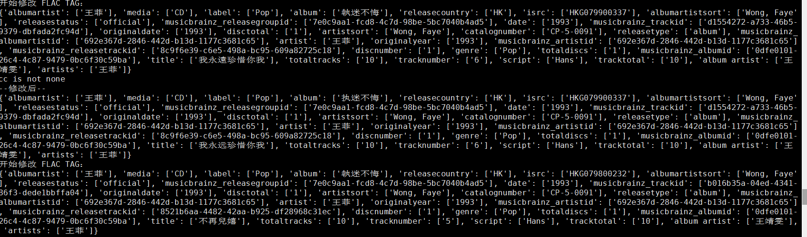
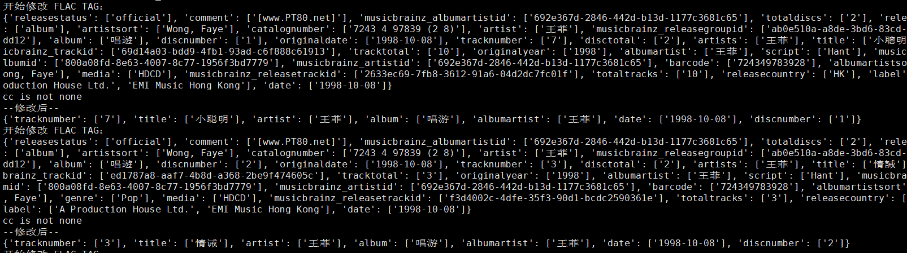
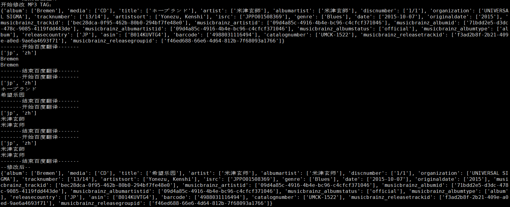

# 不再维护，建议使用[music_tag_tool](https://github.com/backtracker/music_tag_tool)   --2024年12月31日

# 音乐文件Tag清洗程序


## 简介

音乐文件Tag清洗程序。支持mp3,flac,m4a格式。中文简繁转换使用opencc库,其他语言转换走百度翻译。

需要翻译的请注册个人开发者，申请app key 并填入变量中。 https://api.fanyi.baidu.com/doc/12 

## 说明

**清洗类型，默认为1。**

0:只清洗并保留艺术家、标题、专辑、专辑艺术家、音轨号、光盘号，其余全部清除
1:只对艺术家、标题、专辑、专辑艺术家进行清洗，其他Tag不处理

 **语言支持：**

 auto:自动检测、zh:中文、jp:日语、cht:繁体中文
 支持翻译语言类型请见百度翻译文档：https://api.fanyi.baidu.com/doc/21

### 使用方法

1. 简体中文的音乐Tag转换为简体中文

   ```shell
   python audio_tag_tool.py -m <音乐目录>
   ```

   

2. 强力清洗

   ```shell
   python audio_tag_tool.py -m <音乐目录> -c 0
   ```

   

3. 日语音乐Tag翻译成简体中文

   ```shell
   python audio_tag_tool.py -m <音乐目录> -s jp -d zh
   ```

   

